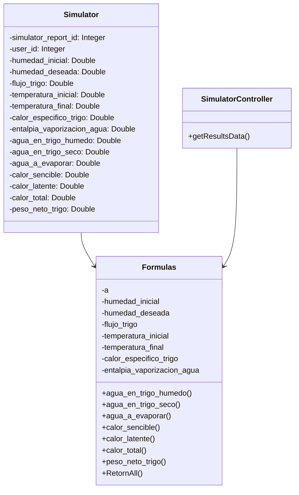
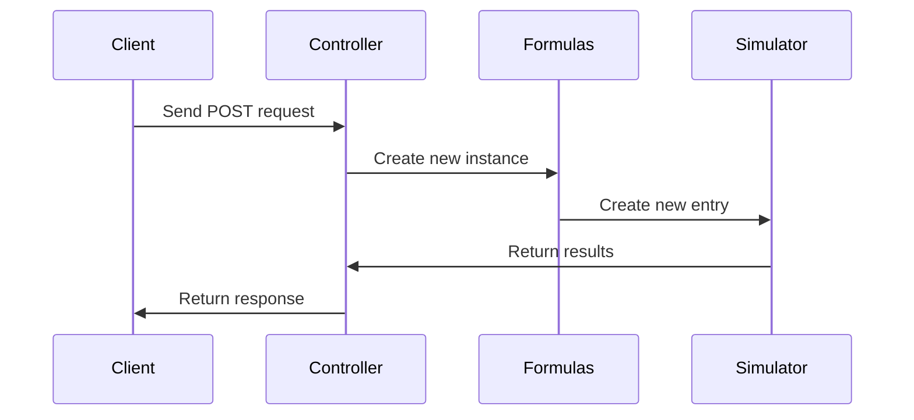

#Diagrama de Clases

```mermaid
classDiagram
    class Simulator {
        -simulator_report_id: Integer
        -user_id: Integer
        -humedad_inicial: Double
        -humedad_deseada: Double
        -flujo_trigo: Double
        -temperatura_inicial: Double
        -temperatura_final: Double
        -calor_especifico_trigo: Double
        -entalpia_vaporizacion_agua: Double
        -agua_en_trigo_humedo: Double
        -agua_en_trigo_seco: Double
        -agua_a_evaporar: Double
        -calor_sencible: Double
        -calor_latente: Double
        -calor_total: Double
        -peso_neto_trigo: Double
    }
    class Formulas {
        -a
        -humedad_inicial
        -humedad_deseada
        -flujo_trigo
        -temperatura_inicial
        -temperatura_final
        -calor_especifico_trigo
        -entalpia_vaporizacion_agua
        +agua_en_trigo_humedo()
        +agua_en_trigo_seco()
        +agua_a_evaporar()
        +calor_sencible()
        +calor_latente()
        +calor_total()
        +peso_neto_trigo()
        +RetornAll()
    }
    class SimulatorController {
        +getResultsData()
    }
    Simulator --> Formulas
    SimulatorController --> Formulas

```

# Diagrama de Uso

```mermaid
sequenceDiagram
    participant Client
    participant Controller
    participant Formulas
    participant Simulator

    Client ->> Controller: Send POST request
    Controller ->> Formulas: Create new instance
    Formulas ->> Simulator: Create new entry
    Simulator ->> Controller: Return results
    Controller ->> Client: Return response

```